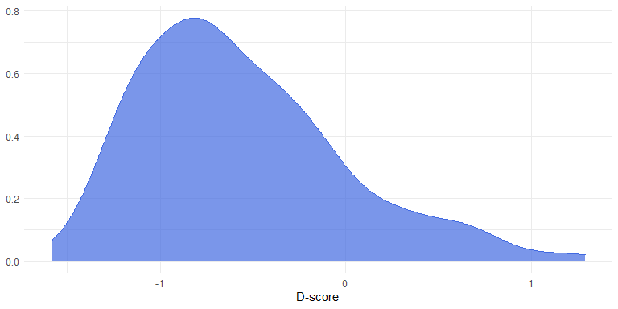

<!-- README.md is generated from README.Rmd. Please edit that file -->

# implicitMeasures

R package for computing different Implicit Measures scores
<!-- badges: start --> [Travis build
status](https://travis-ci.org/OttaviaE/implicitMeasures.svg?branch=master)\](<https://travis-ci.org/OttaviaE/implicitMeasures>)
<!-- badges: end -->

## Aim and Overview

The goal of `implicitMeasures` package is to provide a tool for easily
cleaning and computing the scores for the Implicit Association Test
(IAT; Greenwald, McGhee, and Schwartz 1998) and the Single Category
Implicit Association Test (SC-IAT; Karpinski and Steinman 2006).

Six different algorithms for the computation of the IAT effect, the
so-called *D-score*, are available (Greenwald, Nosek, and Banaji 2003).
The six different algorithms differentiate themselves for the treatment
of the extreme fast responses and for the strategy used for replacing
the error responses. Different mistakes can be made during the
computation of the *D-score*, which can raise replicability issues of
the results. On top of that, many researchers fail to report the exact
algorithm they have used for computing the *D-score*, raising again
replicability issues (Ellithorpe, Ewoldsen, and Velez 2015).

`implicitMeasures` includes the following functions:

  - `clean_iat()`: Prepare and clean IAT data.
  - `clean_sciat()`: Prepare and clean SC-IAT data.
  - `computeD()`: Compute IAT *D-score*.
  - `Dsciat()`: Compute SC-IAT *D-score*.
  - `descript_d()`: Descriptive table of *D-score*s (also in LaTeX
    format).
  - `d_distr()`: Plot IAT or SC-IAT scores (distribution).
  - `d_plot()`: Plot IAT or SC-IAT scores (points).
  - `multi_dscore()`: Compute and plot multiple IAT *D-score*s.
  - `multi_dsciat()`: Plot SC-IAT *D-score*s.
  - `IATrel()`: computes the IAT reliability (Gawronski et al. 2017)

All the functions for graphically representing the results are based on
`ggplot2` (Wickham 2016).

## Installation

You can install the released version of `implicitMeasures` from
[CRAN](https://CRAN.R-project.org) with:

``` r
install.packages("implicitMeasures")
```

and the development version from [GitHub](https://github.com/) with:

``` r
# install.packages("devtools")
devtools::install_github("OttaviaE/implicitMeasures")
```

## Example

This is a basic example which shows you how to compute the IAT
*D-score*. More detailed examples are given in the package vignettes.

``` r
library(implicitMeasures)
## load the raw_data dataframe
data("raw_data")

## prepare the dataset for the computation
iat_data <- clean_iat(raw_data, 
                          sbj_id = "Participant",
                          block_id = "blockcode",
                          mapA_practice = "practice.iat.Milkbad",
                          mapA_test = "test.iat.Milkbad",
                          mapB_practice = "practice.iat.Milkgood",
                          mapB_test = "test.iat.Milkgood",
                          latency_id = "latency",
                          accuracy_id = "correct",
                          trial_id = "trialcode",
                          trial_eliminate = c("reminder", "reminder1"))

## store the dataset for computing the D-score
iat <- iat_data[[1]]

## Compute the D-score
dscore <- computeD(iat, D = "d3")
```

`computeD()` results in a data frame with class `dscore`. This data
frame can be passed to other functions, for example for plotting the
results, either at the individual level:

<div class="figure" style="text-align: center">


<p class="caption">

Graphical representation of respondents’ individual scores

</p>

</div>

or at the sample level:

<div class="figure" style="text-align: center">



<p class="caption">

Density distribution of sample scores

</p>

</div>

## Data import

You can import your data in any format you want. If you are importing
data sets from SPSS, please use either
`haven::read_sav("~/path/to/mydata.sav")` or
`foreign::read.spss("~/path/to/mydata.sav")` without changing the
default options of the functions. `implicitMeasures` will recognize that
the data frame is coming from SPSS and will handle that.

## Bugs and problems

If you find any bugs or encounter any problems in using this package,
please post a minimal reproducible example on
[github](https://github.com/OttaviaE/implicitMeasures/issues). For
questions and other discussions, you can contact the author and
maintainer of the package at <otta.epifania@gmail.com>.

# References

<div id="refs" class="references">

<div id="ref-ellithorpe2015">

Ellithorpe, Morgan E, David R Ewoldsen, and John A Velez. 2015.
“Preparation and Analyses of Implicit Attitude Measures: Challenges,
Pitfalls, and Recommendations.” *Communication Methods and Measures* 9
(4): 233–52. <https://doi.org/10.1080/19312458.2015.1096330>.

</div>

<div id="ref-gaw2017">

Gawronski, Bertram, Mike Morrison, Curtis E Phills, and Silvia Galdi.
2017. “Temporal Stability of Implicit and Explicit Measures: A
Longitudinal Analysis.” *Personality and Social Psychology Bulletin* 43
(3): 300–312. <https://doi.org/10.1177/0146167216684131>.

</div>

<div id="ref-Greenwald:1998">

Greenwald, Anthony G, Debbie E McGhee, and Jordan L K Schwartz. 1998.
“Measuring Individual Differences in Implicit Cognition: The Implicit
Association Test.” *Journal of Personality and Soclal Psychology* 74
(6): 1464–80. <https://doi.org/10.1037/0022-3514.74.6.1464>.

</div>

<div id="ref-Greenwald2003">

Greenwald, Anthony G, Brian A Nosek, and Mahzarin R Banaji. 2003.
“Understanding and Using the Implicit Association Test: I. An Improved
Scoring Algorithm.” *Journal of Personality and Social Psychology* 85
(2): 197–216. <https://doi.org/10.1037/0022-3514.85.2.197>.

</div>

<div id="ref-karpinski2006">

Karpinski, Andrew, and Ross B. Steinman. 2006. “The Single Category
Implicit Association Test as a measure of implicit social cognition.”
*Journal of Personality and Social Psychology* 91 (1): 16–32.
<https://doi.org/10.1037/0022-3514.91.1.16>.

</div>

<div id="ref-ggplot2">

Wickham, Hadley. 2016. *Ggplot2: Elegant Graphics for Data Analysis*.
Springer-Verlag New York. <https://ggplot2.tidyverse.org>.

</div>

</div>
